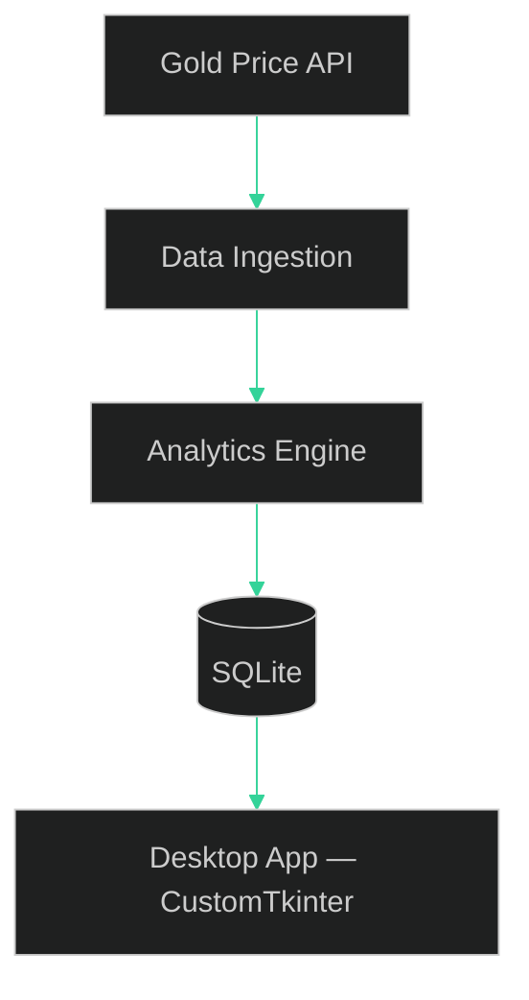
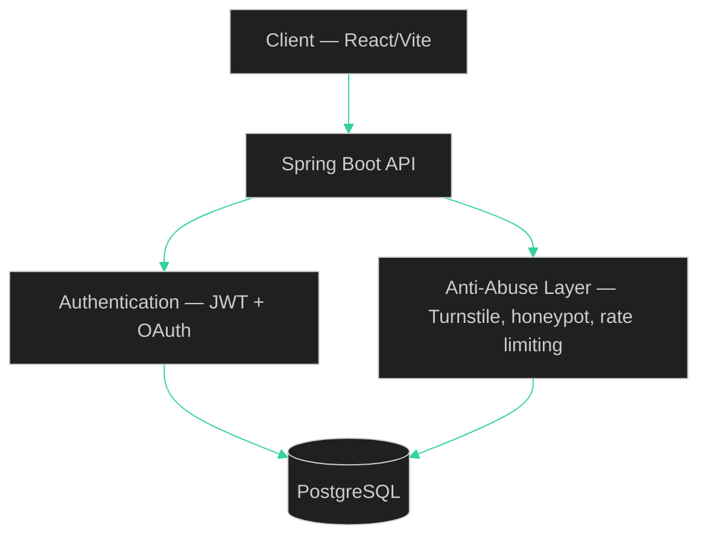

# Harsha Vardhan Burra

**Engineering products where reliability matters as much as features.**

Building performant software, production-ready systems, and developer-focused tools.

  
  
    harsha-vardhan-burra
  

 

## About

I like building the part of a project that only becomes visible once it leaves your machine — the packaging edge case, the abuse vector, the state bug that only shows up on a slow connection. A desktop app and a SaaS backend taught me the same lesson from different directions: shipping is where the real engineering starts.

 

## Currently

|                   |                                                                                                                                     |
| ----------------- | ----------------------------------------------------------------------------------------------------------------------------------- |
| **Building**      | [GoldTracker](https://github.com/harsha-vardhan-burra/GoldTracker) v2, [SnapLink](https://github.com/harsha-vardhan-burra/SnapLink) |
| **Learning**      | System design, containerized deployments                                                                                            |
| **Interested in** | Backend engineering, abuse-resistant systems, developer tooling                                                                     |

 

## Engineering Philosophy

- **A feature isn't complete when it works — it's complete when it fails safely.** Abuse handling and edge cases are part of the spec, not cleanup work.
- **Match the infrastructure to the problem, not to what's impressive.** SQLite suits a single-user desktop tool; PostgreSQL suits a multi-tenant service. The interesting decision is knowing which is which.
- **Automate the decision, not just the task.** Conventional commits and semantic versioning exist so the _reasoning_ behind a release survives, not just the code.
- **Packaging is part of the product.** Software that only runs on the machine that built it isn't shipped yet.
- **The happy path is the easy 80%.** The trust of the system is built in the other 20% — expired sessions, malformed input, a bot filling out a form too fast.
- **Trade-offs should be visible, not hidden.** Every architectural choice below has a reason it wasn't the other option.

 

## Featured Projects

### GoldTracker

**Problem.** Gold is a core household savings instrument in India, but retail tooling for tracking it is either locked inside a brokerage app or a manually-updated spreadsheet — nothing sits in between as a lightweight, offline-first personal tool.

**Solution.** A native Windows desktop application that polls live market data, persists it locally, and turns raw price history into portfolio-level analytics without any server dependency once installed.

**Interesting engineering decisions**

- Structured delivery into four sequential phases — ingestion, portfolio tracking, data integrity, analytics — so each layer was provably correct before the next one depended on it.
- Indexed historical price lookups with **bisect** instead of linear scans, reducing lookup complexity from linear scans to logarithmic searches over months of use.
- Returned analytics as **dataclasses** rather than dictionaries, trading a little verbosity for typed, self-documenting results the UI layer can rely on.

**Technical challenges**

- A PyInstaller packaging bug meant file paths resolved correctly in development but broke once frozen into an executable — fixed by making path resolution frozen-aware, a class of bug that's invisible until the moment you actually ship.

**Impact.** An installable desktop tool with a real tagged-release history, not a script that only runs on one machine.

<strong>Architecture</strong>

**Stack:** Python · CustomTkinter · SQLite · matplotlib · pystray · PyInstaller

---

### SnapLink

**Problem.** A URL shortener is trivial until it's public — without abuse controls, it quietly becomes free infrastructure for spam and phishing redirects within days of launch.

**Solution.** A full-stack shortening platform where authentication and abuse-resistance were designed in from the start, not added after the first incident.

**Interesting engineering decisions**

- Spring Boot was chosen for its mature ecosystem around security, dependency injection, and production-ready backend development.
- Combined **JWT authentication with OAuth** (Google, GitHub) and a Remember Me flow — weighing session convenience against token exposure rather than defaulting to the longest-lived option.
- Layered abuse defenses — **disposable-email blocking, Turnstile bot protection, honeypot fields, rate limiting** — so no single check is a single point of failure.
- Chose **PostgreSQL** over a file-backed store for the concurrency and durability a multi-tenant SaaS needs under real load.

**Technical challenges**

- Tracked down environment-variable misuse and React state corruption on client-side navigation before deployment — the class of bug that only surfaces once a user actually clicks around instead of reloading the page.

**Impact.** A shortener engineered to hold up under public traffic, not just under a local demo.

<strong>Architecture</strong>

**Stack:** Spring Boot · React/Vite · PostgreSQL

Both repositories above are personal projects with real release/commit histories — not external open-source contributions, which I don't have on record yet.

 

## ⚡ Engineering Capabilities

<table>
<tr>

<td width="50%" valign="top">

### ⚙️ Backend Engineering

Designing secure backend systems focused on:

- REST APIs
- JWT / OAuth
- Rate Limiting
- Production Reliability

</td>

<td width="50%" valign="top">

### 🎨 Frontend Engineering

Building polished user experiences through:

- Component-driven UI
- Responsive Design
- GSAP Animations
- Performance Optimization

</td>

</tr>

<tr>

<td width="50%" valign="top">

### 🖥 Desktop Engineering

Creating native desktop applications with:

- Offline-first Architecture
- Local Persistence
- Packaging
- Analytics

</td>

<td width="50%" valign="top">

### 🛠 Developer Workflow

Shipping software through:

- Version Control
- Automation
- Release Management
- Developer Tooling

</td>

</tr>

</table>

## Roadmap

**Shipped**

- [x] GoldTracker — four-phase build, tagged releases
- [x] SnapLink — auth, anti-abuse layer, core shortening flow

**In progress**

- [ ] GoldTracker v2 — deeper analytics, refined UX
- [ ] SnapLink — production deployment hardening (current goal: take it from "working" to "survives being public")

**Next**

- [ ] Docker-based deployment workflows
- [ ] AWS fundamentals for real infrastructure deployment
- [ ] System design — moving from "it works" to "it scales"

 

## 🔗 Find Me Online

  

 

## GitHub Metrics

  
  

  

  <picture>
    <source media="(prefers-color-scheme: dark)"
srcset="https://raw.githubusercontent.com/harsha-vardhan-burra/harsha-vardhan-burra/output/pacman-dark.svg">

<source media="(prefers-color-scheme: light)"
srcset="https://raw.githubusercontent.com/harsha-vardhan-burra/harsha-vardhan-burra/output/pacman.svg">

</picture>

